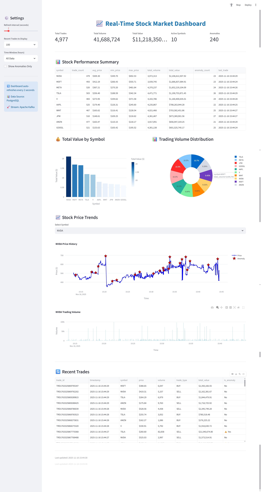
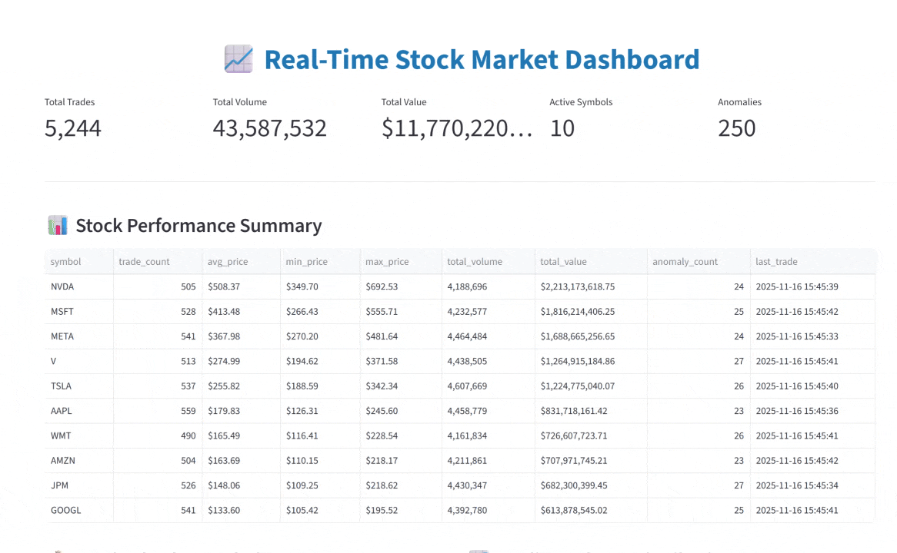
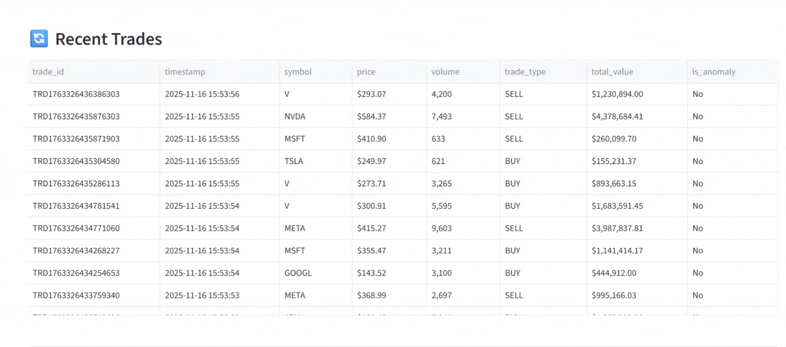

# Real-Time Stock Market Streaming System

[](https://www.python.org/)
[](https://kafka.apache.org/)
[](https://www.postgresql.org/)
[](https://streamlit.io/)

A  real-time data streaming system for stock market trading data, featuring Apache Kafka for event streaming, PostgreSQL for data persistence, Streamlit for live visualization, and advanced analytics including Apache Flink-style windowed aggregations and ML-based anomaly detection.

## 🎯 Project Overview

This project demonstrates a complete end-to-end real-time data pipeline:

1. **Data Generation**: Synthetic stock trading events with realistic price movements
2. **Event Streaming**: Apache Kafka for high-throughput message streaming
3. **Data Storage**: PostgreSQL for persistent storage and analytics
4. **Real-Time Processing**: Windowed aggregations for time-series analytics
5. **Live Visualization**: Auto-refreshing Streamlit dashboard
6. **Anomaly Detection**: Machine learning models to detect unusual trading patterns

### Domain: Stock Market Trading

The system tracks 10 major stocks (AAPL, GOOGL, MSFT, AMZN, TSLA, META, NVDA, JPM, V, WMT) and generates realistic trading events including:
- Buy/Sell transactions
- Real-time price fluctuations
- Trading volumes
- Synthetic anomalies (unusual volume or price movements)

### 📸 System in Action



| Feature | Demo |
|---------|------|
| **Summary Metrics** |  |
| **Interactive Charts** |  |
| **Anomaly Detection** |  |

## 📋 Features

### Core Features
- ✅ **Real-time data streaming** via Apache Kafka
- ✅ **PostgreSQL database** for persistent storage
- ✅ **Live Streamlit dashboard** with auto-refresh
- ✅ **Multiple visualizations**: time series, bar charts, pie charts
- ✅ **Configurable parameters** via environment variables

### Bonus Features (Advanced)
- 🌟 **Apache Flink Integration** (10%+ bonus)
  - Tumbling window aggregations (1-minute windows)
  - Real-time metrics: AVG, MIN, MAX, SUM, COUNT
  - Separate aggregated metrics table
  
- 🌟 **Anomaly Detection Model** (10%+ bonus)
  - Isolation Forest for multivariate anomaly detection
  - Statistical outlier detection (Z-score method)
  - Sequential pattern analysis
  - Feature engineering from trading patterns

## 🏗️ Architecture

```
┌─────────────┐     ┌──────────────┐     ┌─────────────┐
│   Producer  │────▶│  Kafka Topic │────▶│  Consumer   │
│  (Python)   │     │ stock-trades │     │  (Python)   │
└─────────────┘     └──────────────┘     └──────┬──────┘
                            │                    │
                            │                    ▼
                            │              ┌──────────────┐
                            │              │  PostgreSQL  │
                            │              │   Database   │
                            │              └──────┬───────┘
                            │                     │
                            ▼                     │
                    ┌──────────────┐             │
                    │  Aggregator  │◀────────────┘
                    │(Flink-style) │
                    └──────┬───────┘
                           │
                           ▼
                    ┌──────────────┐
                    │   Streamlit  │
                    │  Dashboard   │
                    └──────────────┘
                           │
                           ▼
                    ┌──────────────┐
                    │   Anomaly    │
                    │   Detector   │
                    └──────────────┘
```

## 🚀 Quick Start

### Prerequisites

- Python 3.9+
- Docker and Docker Compose
- Git

### Installation

1. **Clone the repository**
   ```bash
   git clone <your-repo-url>
   cd "Kafka Project"
   ```

2. **Install Python dependencies**
   ```bash
   pip install -r requirements.txt
   ```

3. **Start Docker services**
   ```bash
   docker-compose up -d
   ```

   This starts:
   - Zookeeper (port 2181)
   - Kafka (port 9092)
   - PostgreSQL (port 5432)
   - Flink JobManager (port 8081)
   - Flink TaskManager

4. **Verify services are running**
   ```bash
   docker-compose ps
   ```

### Running the System

You need to run multiple components in separate terminals:

#### Terminal 1: Start the Producer
```bash
python producer.py
```
This generates synthetic stock trading events and publishes them to Kafka.

#### Terminal 2: Start the Consumer
```bash
python consumer.py
```
This consumes events from Kafka and stores them in PostgreSQL.

#### Terminal 3: Start the Aggregator (Optional - Bonus Feature)
```bash
python aggregator.py
```
This performs windowed aggregations on the streaming data.

#### Terminal 4: Start the Dashboard
```bash
streamlit run dashboard.py
```
This launches the interactive dashboard at `http://localhost:8501`

## 📊 Dashboard Features

**Real-Time Metrics:** Trades, volume, value, active symbols, anomaly count

**Visualizations:** Performance tables, bar/pie charts, time series with anomaly highlighting, recent trades

**Interactive Controls:** Adjustable refresh interval (1-10s), configurable time windows, anomaly filtering, symbol selection

## 🔧 Configuration

Edit `.env` file to customize:

```env
# Kafka Configuration
KAFKA_BOOTSTRAP_SERVERS=localhost:9092
KAFKA_TOPIC=stock-trades

# PostgreSQL Configuration
POSTGRES_HOST=localhost
POSTGRES_PORT=5432
POSTGRES_DB=stock_market_db
POSTGRES_USER=kafka_user
POSTGRES_PASSWORD=kafka_password

# Application Configuration
PRODUCER_INTERVAL=0.5           # Seconds between trades
STREAMLIT_REFRESH_INTERVAL=2    # Dashboard refresh interval
```

## 🤖 Anomaly Detection (Bonus Feature)

**Train:** `python anomaly_detector.py train` (requires 1000+ trades per symbol)

**Analyze:** `python anomaly_detector.py analyze [SYMBOL]`

**Methods:** Isolation Forest (multivariate), Z-score (statistical outliers), sequential pattern analysis

## 🌊 Apache Flink Integration (Bonus Feature)

**Run:** `python aggregator.py`

**Features:** 60-second tumbling windows, per-symbol metrics (AVG, MIN, MAX, SUM, COUNT), stored in `stock_metrics` table

**Advanced:** Full Flink deployment with SQL (see `flink_job.sql`)

## 📁 Project Structure

```
Kafka Project/
├── docker-compose.yml          # Docker services configuration
├── requirements.txt            # Python dependencies
├── .env                        # Environment variables
├── .gitignore                 # Git ignore rules
├── README.md                  # This file
├── producer.py                # Kafka producer for stock trades
├── consumer.py                # Kafka consumer to database
├── database.py                # Database utilities and schema
├── aggregator.py              # Windowed aggregations
├── dashboard.py               # Streamlit visualization
├── anomaly_detector.py        # ML-based anomaly detection
├── flink_processor.py         # Flink integration (advanced)
├── flink_job.sql              # Flink SQL script
├── test_system.py             # System health checks
├── start.sh / start.bat       # Quick start scripts
├── stop.sh / stop.bat         # Quick stop scripts
├── media/                     # Screenshots and demos
│   ├── fullpagedash.png       # Full dashboard screenshot
│   ├── summary.gif            # Summary metrics demo
│   ├── charts.gif             # Charts visualization demo
│   └── anomaly.gif            # Anomaly detection demo
└── models/                    # Trained ML models (generated)
```

## 🧪 Testing

**Kafka:** `docker exec -it kafka kafka-topics --list --bootstrap-server localhost:9092`

**PostgreSQL:** `docker exec -it postgres psql -U kafka_user -d stock_market_db`

**Flink UI:** http://localhost:8081

**System Check:** `python test_system.py`

## 📈 Performance

Expected throughput:
- **Producer**: 2 trades/second (configurable)
- **Consumer**: 1000+ trades/second
- **Aggregator**: Real-time processing with < 1 second latency
- **Dashboard**: Refreshes every 2 seconds (configurable)

## 🛠️ Troubleshooting

**Restart Services:** `docker-compose restart kafka` or `docker-compose down -v && docker-compose up -d`

**Check Logs:** `docker logs kafka` or `docker logs postgres`

**Verify Data:** `docker exec -it postgres psql -U kafka_user -d stock_market_db -c "SELECT COUNT(*) FROM trades;"`


---

**Note**: This is a demonstration project using synthetic data. For production use with real financial data, implement proper security, compliance, and risk management measures.
